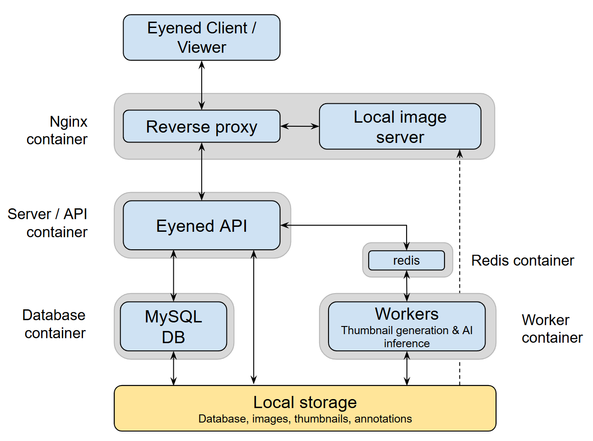

The Eyened platform consists of several interconnected services that work together to provide a complete ophthalmic image management and annotation solution.

## Architecture Overview

## Core Services

### Client
- Web-based viewer built with Svelte and WebGL2
- Browser-based rendering of images and annotations

### API Server
- FastAPI backend for data management and business logic
- Task queue system (Huey/Redis) for managing long-running operations (inference, thumbnail generation)

### Data Management
- **MySQL** (8.0.27) for structured data storage
- **Adminer** for database management (accessible on port 8080)
- **Storage:**
  - Original images (mounted at `IMAGES_BASEPATH`)
  - Generated thumbnails (zarr-compatible storage)
  - Segmentations (zarr format at `SEGMENTATIONS_ZARR_STORE`)

### Fileserver
- Nginx-based service for serving images and thumbnails
- Exposes the platform on the configured `PORT`

### Worker
- Background task processor (Huey)
- Handles image processing, segmentation storage, and thumbnail generation

### Development Tools
- [Import API](/eyened-platform/importing_data) for loading images and metadata via REST
- Python ORM (`eyened_orm`) for database access and batch imports
- `ImageImporter` utility for API-based imports from Python

For detailed setup instructions, see the [Getting Started](/eyened-platform/getting_started) guide.
